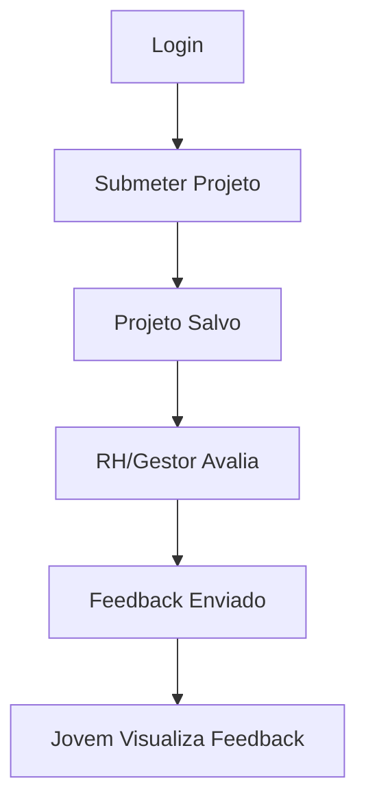

# SimplyInvite - Plataforma de Conexão entre Talentos e Empresas

## Sumário

- [Descrição](#descrição)
- [Estrutura do Projeto](#estrutura-do-projeto)
- [Como Executar](#como-executar)
- [Exemplos de Uso da API](#exemplos-de-uso-da-api)
- [Fluxos de Usuário](#fluxos-de-usuário)
- [Pontos de Melhoria](#pontos-de-melhoria)
- [Contribuição](#contribuição)
- [Licença](#licença)

---

## Descrição

SimplyInvite é uma plataforma web que conecta jovens talentos a empresas, permitindo o envio e avaliação de projetos, feedbacks e interação entre diferentes perfis (Jovem Talento, RH, Gestor).

---

## Estrutura do Projeto

```
simplyinvite-showcase-page/
├── backend/
├── frontend/
├── docker-compose.yml
└── README.md
```

---

## Como Executar

1. Clone o repositório.
2. Configure as variáveis de ambiente.
3. Execute `docker-compose up` na raiz do projeto.

---

## Exemplos de Uso da API

### Criar Projeto

**Requisição**

```http
POST /api/projetos
Content-Type: application/json

{
  "titulo": "Projeto de Exemplo",
  "descricao": "Descrição do projeto",
  "autorId": "uuid-do-autor"
}
```

**Resposta**

```json
{
  "id": "uuid-do-projeto",
  "titulo": "Projeto de Exemplo",
  "descricao": "Descrição do projeto",
  "autorId": "uuid-do-autor",
  "dataCriacao": "2025-05-18T12:00:00Z"
}
```

---

### Listar Projetos

**Requisição**

```http
GET /api/projetos
```

**Resposta**

```json
[
  {
    "id": "uuid-do-projeto",
    "titulo": "Projeto de Exemplo",
    "descricao": "Descrição do projeto",
    "autorId": "uuid-do-autor",
    "dataCriacao": "2025-05-18T12:00:00Z"
  }
]
```

---

### Avaliar Projeto

**Requisição**

```http
POST /api/avaliacoes
Content-Type: application/json

{
  "projetoId": "uuid-do-projeto",
  "avaliadorId": "uuid-do-avaliador",
  "nota": 9,
  "comentario": "Ótimo trabalho!"
}
```

**Resposta**

```json
{
  "id": "uuid-da-avaliacao",
  "projetoId": "uuid-do-projeto",
  "avaliadorId": "uuid-do-avaliador",
  "nota": 9,
  "comentario": "Ótimo trabalho!",
  "dataAvaliacao": "2025-05-18T13:00:00Z"
}
```

---

## Fluxos de Usuário

### 1. Submissão de Projeto

1. Jovem Talento faz login.
2. Acessa o painel e clica em "Novo Projeto".
3. Preenche o formulário e envia.
4. Projeto é salvo e aparece no painel do usuário.

### 2. Avaliação de Projeto

1. RH/Gestor acessa a lista de projetos.
2. Seleciona um projeto para avaliar.
3. Preenche nota e comentário.
4. Avaliação é registrada e feedback enviado ao autor.

### 3. Feedback

1. Jovem Talento recebe notificação de avaliação.
2. Visualiza feedback detalhado no painel.
3. Pode responder ou ajustar o projeto conforme orientações.

#### Diagrama de Fluxo (Exemplo)



---

## Pontos de Melhoria

- Implementar autenticação e autorização robustas.
- Adicionar testes automatizados (frontend e backend).
- Melhorar responsividade e acessibilidade.
- Documentar todos os endpoints da API (Swagger/OpenAPI).
- Centralizar variáveis de ambiente sensíveis.

---

## Contribuição

Sinta-se à vontade para abrir issues ou pull requests!

---

## Licença

MIT
